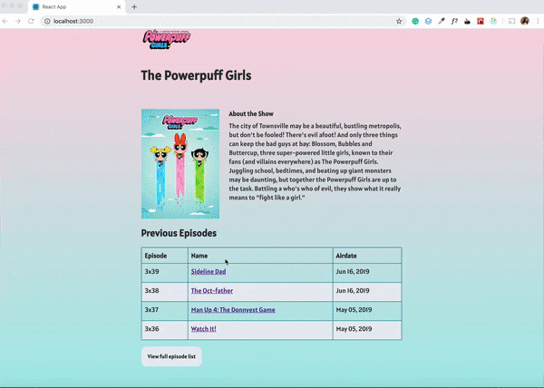

This project was bootstrapped with [Create React App](https://github.com/facebook/create-react-app).

# Powerpuff Girls TV show app

## App Demo



## Backlog

[Trello board of the app](https://trello.com/b/R1oMQ3y5/powerpuffgirls)


## Project Setup

* Clone the app

```git clone git@github.com:YOUR_GITHUB_NAME/YOUR_PROJECT_NAME.git```

* cd into your project

```cd YOUR_PROJECT_NAME```

* install dependencies
```npm install```

* Start the app with npm start
```npm start```


## Features
* Display details of the tv Show on the main page
  * Name of the Show
  * Show title
  * Show Description
  * Show cover image
  * Collapsible Episode list
* Every episode in the list links to a details page for that specific episode
* Display details of the episode on the episode detail page
  * Episode title
  * Episode Summary
  * Episode cover image
  * Episode run time
  * Season and episode number
* Link to the show page from episode detail page

## Tech used

* React
* Redux
* Sass
* Jest

